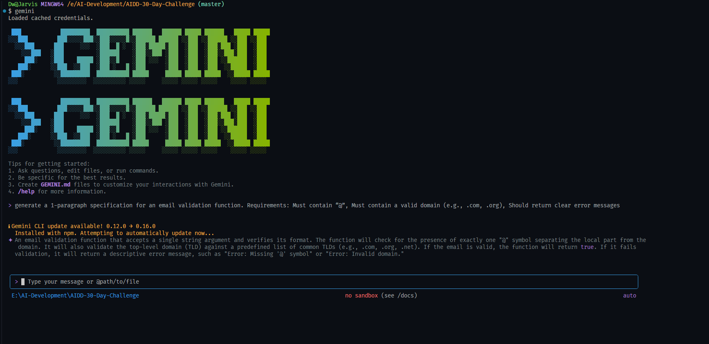

# Therory

# 1) Nine Pillars Understanding

### Question 1

Kyunke aap apna time aur energy boring setup par waste nahi karte. AI saara boilerplate bana deta hai, aur aap architecture, flow, aur system design par focus karte ho. Isi wajah se aap technician nahi, system architect ki tarah sochna start kar dete ho.

### Question 2: Nine Pillars developer ko M-Shaped Developer kaise banate hain?

Nine Pillars aapko multiple areas me depth aur breadth dete hain. Aap sirf coding nahi, balkay:

- architecture

- testing

- automation

- DevOps

- AI integration

### Q1

Kyunke bina plan coding hoti hai. Code messy ho jata hai, structure toot jata hai, bugs trace nahi hote, aur developer ko khud samaj nahi aata ke kya likha tha.

### Q2

Isme pehle clear plan hota hai routes, flows, data, logic sab define hota hai. Is liye code consistent, predictable aur maintainable hota hai.

# 3) Architecture Thinking

### Q1

Developer sirf “code writer” nahi rehta. Woh system designer ban jata hai flows, layers, integrations aur logic map karta hai. Code AI generate bhi kar sakta hai, lekin architecture human design karta hai.

### Q2

Kyunke large systems raw code se control nahi hote. Layers se clarity milti hai:

UI alag, API alag, business logic alag, database alag
Is se scale, debugging aur future changes easy ho jate hain.

# MCQS

## Multiple Choice Questions

- B
- B
- B
- B
- C

# Practical Screen Shot

## Practical Task

