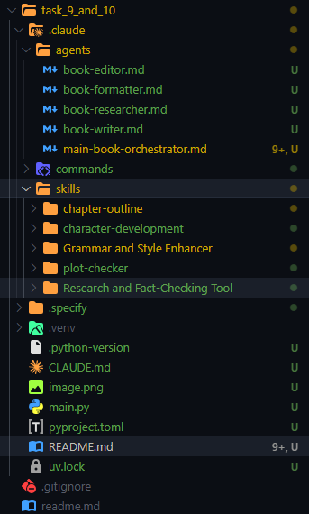
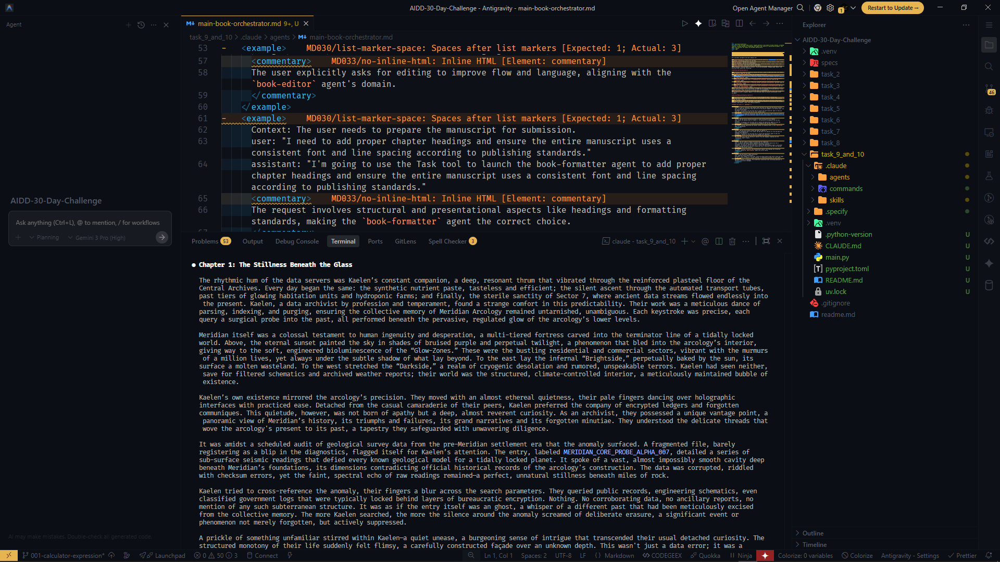

# AI-Driven Development – 30-Day Challenge

## Tasks 9 & 10 Submission

**Student:** [Your Name]  
**Instructor:** Sir Hamzah Syed  
**Slot:** Friday — 6:00 PM to 9:00 PM

---

## ✅ Task Objective

For **Task 9**: Create Claude Code **Skills** to enhance book generation.  
For **Task 10**: Create and orchestrate Claude Code **Sub-Agents** to handle research, writing, editing, and formatting collaboratively.

These tasks demonstrate the ability to build reusable AI tools and coordinate multiple agents for a complex workflow.

---

## 📂 Submission Contents

-   `.claudecode` directory screenshot (showing all Skills and Sub-Agents)
-   
-   `.md` files for the Skills and Sub-Agents:

### Skills Created (Task 9)

1. **Chapter Outline Generator** — Plan and structure book chapters.
2. **Character Development Assistant** — Create detailed character profiles.
3. **Plot Consistency Checker** — Ensure story logic and pacing.
4. **Research and Fact-Checking Tool** — Validate claims, summarize sources.
5. **Grammar and Style Enhancer** — Improve readability, tone, and correctness.

### Sub-Agents Created (Task 10)

-   **Main Orchestrator Agent** — Coordinates all sub-agents.
-   **Research Sub-Agent** — Gathers reliable information and references.
-   **Writing Sub-Agent** — Drafts chapters based on research.
-   **Editing Sub-Agent** — Polishes grammar, style, and readability.
-   **Formatting Sub-Agent** — Prepares finalized, publish-ready manuscript.

---

## ⚙️ Workflow Example

1. User requests: `"Help me write a science fiction book about AI ethics."`
2. Main Orchestrator dispatches research tasks to **Research Sub-Agent**.
3. **Research Sub-Agent** returns verified sources and insights.
4. **Writing Sub-Agent** drafts chapters using research output.
5. **Editing Sub-Agent** refines grammar and style.
6. **Formatting Sub-Agent** applies final formatting and outputs manuscript.

---

## Final Results

---

## 💡 Notes

-   All Skills and Sub-Agents are designed for **reusability** in multiple book projects.
-   Focused on collaborative workflow, modularity, and maintainability.
-   Screenshots included to verify the `.claude` directory structure.

---
